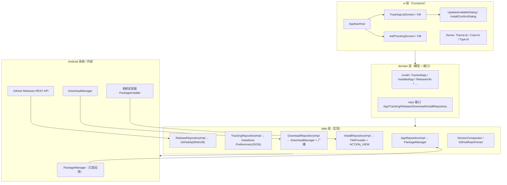
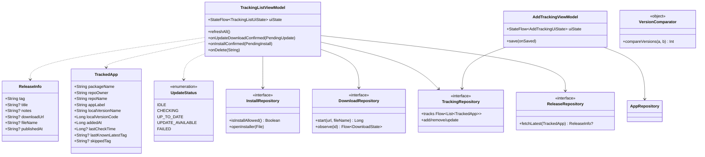
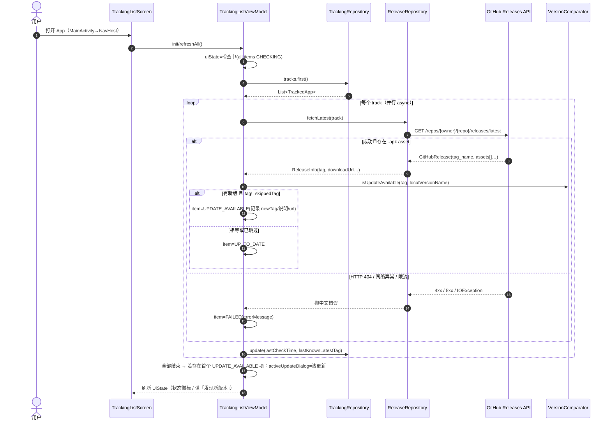

# GitHub 更新检测器 — 系统架构设计（v1.0）

> 角色：架构师 · 高见远（Gao）｜输入：`docs/01-PRD.md`｜配套文件：`docs/03-tasks.md`
> 本设计 100% 覆盖 PRD 需求池 P0 R1–R7 与验收标准 A1–A6（R8–R12 以 P1/P2 形式覆盖或标注范围外）。

---

## 1. 总体方案与分层架构

### 1.1 实现思路

- 原生 Android，**Kotlin + Jetpack Compose + Material 3**，**单 Activity、单模块**，MVVM（UI / ViewModel / Repository / DataSource）。
- 数据流单向：`ViewModel` 持有 `StateFlow<UiState>`，UI 用 `collectAsStateWithLifecycle` 渲染；用户操作 → ViewModel → Repository（Retrofit / DataStore / DownloadManager / PackageManager）。
- 持久化用 **DataStore Preferences 存 JSON 字符串**（无需 Room），网络用 **Retrofit + kotlinx-serialization converter**，版本比较用自研轻量语义化比较器。
- 版本追踪、下载、安装三项核心能力均抽象为 Repository 接口，ViewModel 只依赖接口，便于替换与测试。
- 所有文案使用 `res/values/strings.xml`；主题在 Compose 层用 `MaterialTheme`（Material You 动态取色 + 深浅色跟随系统）。

### 1.2 分层架构图（Mermaid）



### 1.3 技术选型结论

| 关注点 | 结论 | 理由 |
|---|---|---|
| UI | Jetpack Compose + Material 3 | PRD 指定 MD3、单 Activity 声明式 UI |
| 架构 | MVVM + Repository 接口 | 测试友好、逻辑可独立验证 |
| 版本比较 | 自研 `VersionComparator` | 需求简单，不引第三方 semver 库，避免 API 版本不匹配 |
| JSON 持久化 | DataStore Preferences + kotlinx.serialization | 仅存一个追踪列表，Room 过重 |
| 网络 | Retrofit2 + converter-kotlinx-serialization | 协程 suspend + 类型安全反序列化 |
| 下载 | 系统 DownloadManager | 免存储权限、系统级下载与通知 |
| 安装 | FileProvider content:// + ACTION_VIEW | 拉起系统安装器，授予临时读权限 |

---

## 2. 模块 / 包结构与职责

包根：`com.example.githubupdater`（源码根：`app/src/main/java/com/example/githubupdater/`）

| 包 | 职责 | 主要内容 |
|---|---|---|
| （根） | 应用入口 | `GitHubUpdaterApp`（Application + 容器）、`MainActivity`（单 Activity） |
| `di` | 依赖容器 | `AppContainer`：懒加载各 Repository 单例并注入 Context |
| `domain/model` | 纯数据模型 | `TrackedApp`、`TrackedAppList`、`InstalledApp`、`GitHubRelease`、`ReleaseAsset`、`ReleaseInfo`、`UpdateStatus` |
| `domain/repo` | Repository 接口 | `AppRepository`、`TrackingRepository`、`ReleaseRepository`、`DownloadRepository`、`InstallRepository` |
| `data/api` | 网络层 | `GitHubApi`（Retrofit 接口）、`ApiFactory`（Retrofit/OkHttp/Json 单例） |
| `data/repository` | Repository 实现 | 五个 `*Impl` |
| `data` | 纯逻辑工具 | `VersionComparator`（语义化版本比较） |
| `util` | 通用工具 | `GitHubRepoParser`（仓库地址归一化/校验） |
| `ui/theme` | MD3 主题 | `Color.kt`、`Theme.kt`、`Type.kt` |
| `ui/navigation` | 导航 | `AppNavHost`（两个路由：列表 / 添加） |
| `ui/trackinglist` | 主界面 | 追踪列表 + 两个确认对话框 + ViewModel + UiState |
| `ui/addtracking` | 添加界面 | 已装应用选择 + 仓库输入 + ViewModel + UiState |
| `ui/components` | 复用组件 | `AppIcon`（PackageManager 图标转 Compose Image） |

> 说明：ViewModel 一律通过 `viewModel(factory = ...)` + `AppContainer` 注入 Repository，不做手写 DI 框架。

---

## 3. 完整文件清单（需工程师创建）

> 相对项目根 `F:\ClawTemp\github更新器\`。除标注外均「新建」。`[改]` 表示后续任务需修改的文件。

### 3.1 Gradle 脚手架（8 个）

| # | 文件 | 内容要点 |
|---|---|---|
| 1 | `settings.gradle.kts` | pluginManagement/dependencyResolutionManagement 仓库、`rootProject.name="github_updater"`、`include(":app")` |
| 2 | `build.gradle.kts`（根） | 声明 4 个插件 alias `apply false` |
| 3 | `gradle.properties` | `android.useAndroidX=true`、JVM 内存、`kotlin.code.style=official` |
| 4 | `gradle/libs.versions.toml` | 版本目录（见第 7 节，版本必须与之一致） |
| 5 | `gradle/wrapper/gradle-wrapper.properties` | `gradle-8.9-bin.zip`（wrapper jar 由 Android Studio 自动生成） |
| 6 | `app/build.gradle.kts` | namespace/applicationId、compileSdk 35、compose 开关、依赖块 |
| 7 | `app/proguard-rules.pro` | 默认空（`minifyEnabled=false`，个人工具不混淆） |
| 8 | `.gitignore` | build/、.gradle/、local.properties 等 |

### 3.2 Manifest 与 res（8 个）

| # | 文件 | 内容要点 |
|---|---|---|
| 9 | `app/src/main/AndroidManifest.xml` | 权限：`INTERNET`、`QUERY_ALL_PACKAGES`、`REQUEST_INSTALL_PACKAGES`；`<application>` 引用 `GitHubUpdaterApp` / `MainActivity`（exported+launcher）；注册 `FileProvider`（authority=`${applicationId}.fileprovider`，引用 `xml/file_paths`） |
| 10 | `app/src/main/res/values/strings.xml` | 全部简体中文文案（应用名、标题、对话框按钮、错误提示等） |
| 11 | `app/src/main/res/values/themes.xml` | 启动 Activity 主题：`Theme.AppUpdater` parent=`android:Theme.Material.Light.NoActionBar`（Compose 模板惯例） |
| 12 | `app/src/main/res/values/colors.xml` | 启动页/图标背景色 `ic_launcher_background`（`#6750A4` MD3 主色） |
| 13 | `app/src/main/res/drawable/ic_launcher_foreground.xml` | 极简矢量前景（圆形+向下箭头，示意"更新"） |
| 14 | `app/src/main/res/mipmap-anydpi-v26/ic_launcher.xml` | 自适应图标（minSdk 26 全覆盖，无需各密度 png） |
| 15 | `app/src/main/res/xml/file_paths.xml` | `<external-files-path name="downloads" path="Download/"/>` 等 |
| 16 | `README.md` | 项目说明 + Android Studio 构建/安装步骤（收尾任务写） |

### 3.3 Kotlin 源码（app/src/main/java/com/example/githubupdater/，共 31 个）

| # | 文件 | 内容要点 |
|---|---|---|
| 17 | `GitHubUpdaterApp.kt` | `Application`；`val container by lazy { AppContainer(this) }` |
| 18 | `di/AppContainer.kt` | 懒加载 5 个 Repository 实现 + Json 实例 |
| 19 | `MainActivity.kt` | `setContent { GitHubUpdaterTheme { AppNavHost() } }` |
| 20 | `domain/model/TrackedApp.kt` | `@Serializable` 追踪项（字段见第 4 节） |
| 21 | `domain/model/TrackedAppList.kt` | `@Serializable(items: List<TrackedApp>)` DataStore 包装 |
| 22 | `domain/model/InstalledApp.kt` | 已装应用展示模型 |
| 23 | `domain/model/ReleaseInfo.kt` | 检测结果（tag/说明/下载地址/文件名） |
| 24 | `domain/model/GitHubRelease.kt` | GitHub API DTO（`@Serializable`，字段见第 4 节） |
| 25 | `domain/model/ReleaseAsset.kt` | assets[] 元素 DTO |
| 26 | `domain/model/UpdateStatus.kt` | enum：`IDLE/CHECKING/UP_TO_DATE/UPDATE_AVAILABLE/FAILED` |
| 27 | `domain/repo/AppRepository.kt` | 接口：获取已安装应用列表 |
| 28 | `domain/repo/TrackingRepository.kt` | 接口：追踪项 CRUD |
| 29 | `domain/repo/ReleaseRepository.kt` | 接口：检测最新版本 |
| 30 | `domain/repo/DownloadRepository.kt` | 接口：下载 APK、观察进度 |
| 31 | `domain/repo/InstallRepository.kt` | 接口：未知来源检查/拉起安装器 |
| 32 | `data/api/GitHubApi.kt` | Retrofit：`GET repos/{owner}/{repo}/releases/latest` |
| 33 | `data/api/ApiFactory.kt` | object：OkHttp(超时10s/15s+logging) + kotlinx Json(ignoreUnknownKeys) + Retrofit |
| 34 | `data/repository/AppRepositoryImpl.kt` | `getInstalledApps()`：PackageManager.getInstalledPackages(0)+launcher 过滤+排序 |
| 35 | `data/repository/TrackingRepositoryImpl.kt` | `Context.dataStore`（Preferences）、JSON 读写、增删改查、`Flow<List<TrackedApp>>` |
| 36 | `data/repository/ReleaseRepositoryImpl.kt` | 调 API → 选首个 `.apk` asset → 映射 `ReleaseInfo`；HttpException/IOException 转中文错误 |
| 37 | `data/repository/DownloadRepositoryImpl.kt` | enqueue 到 `DownloadManager`（目标 `getExternalFilesDir(Download)`）、注册 `ACTION_DOWNLOAD_COMPLETE` 接收器、轮询进度 |
| 38 | `data/repository/InstallRepositoryImpl.kt` | `isInstallAllowed` / `openUnknownSourceSettings` / `openInstaller(file)`（FileProvider + ACTION_VIEW） |
| 39 | `data/VersionComparator.kt` | `compareVersions(tag, local): Int`、`isUpdateAvailable`、`cleanVersion` |
| 40 | `util/GitHubRepoParser.kt` | `parse(input): ParseResult`；支持 `owner/repo`、完整 URL |
| 41 | `ui/theme/Color.kt` | 种子色、浅/深 baseline ColorScheme |
| 42 | `ui/theme/Theme.kt` | `GitHubUpdaterTheme`：`dynamicColor && SDK>=31` → 动态取色，否则 baseline；`darkTheme=isSystemInDarkTheme()` |
| 43 | `ui/theme/Type.kt` | M3 Typography（可最简默认） |
| 44 | `ui/navigation/AppNavHost.kt` | NavHost：`"tracking_list"`、`"add_tracking"` |
| 45 | `ui/trackinglist/TrackingListUiState.kt` | `TrackingListUiState`、`TrackedItemUiState`、`PendingUpdate`、`PendingInstall` |
| 46 | `ui/trackinglist/TrackingListViewModel.kt` | 自动检测编排、状态更新、对话框控制、删除 |
| 47 | `ui/trackinglist/TrackingListScreen.kt` | Scaffold+TopAppBar+刷新+FAB+列表+空态 |
| 48 | `ui/trackinglist/TrackingListItem.kt` | 列表项卡片：图标/应用名/版本/仓库/状态徽标；点击"有新版本"触发对话框；长按或菜单删除 |
| 49 | `ui/trackinglist/UpdateAvailableDialog.kt` | 「发现新版本」对话框（当前/最新版本 + Release 说明 + 暂不/下载更新） |
| 50 | `ui/trackinglist/InstallConfirmDialog.kt` | 「下载完成」对话框（版本号 + 稍后/安装） |
| 51 | `ui/addtracking/AddTrackingUiState.kt` | `AddTrackingUiState`、`RepoValidation` |
| 52 | `ui/addtracking/AddTrackingViewModel.kt` | 加载已装应用、搜索过滤、仓库输入校验、保存 |
| 53 | `ui/addtracking/AddTrackingScreen.kt` | 已装应用单选列表(可搜索) + 仓库 TextField + 保存按钮 |
| 54 | `ui/components/AppIcon.kt` | `@Composable AppIcon(packageName)`：PackageManager 取图标 Drawable → ImageBitmap |

### 3.4 单元测试（2 个）

| # | 文件 | 内容要点 |
|---|---|---|
| 55 | `app/src/test/java/com/example/githubupdater/VersionComparatorTest.kt` | v 前缀/多段/预发布后缀/数字字段比较用例 |
| 56 | `app/src/test/java/com/example/githubupdater/GitHubRepoParserTest.kt` | owner/repo、URL、非法输入用例 |

> 文件合计 **56 个**（另含 Android Studio 自动生成的 `gradle-wrapper.jar`、`.idea/` 等，不计入）。

---

## 4. 核心数据结构、接口与关键类

### 4.1 核心 data class 字段（与代码一一对应）

```kotlin
// —— domain/model/TrackedApp.kt ——
@Serializable
data class TrackedApp(
    val packageName: String,        // 本机应用包名（唯一键）
    val repoOwner: String,          // GitHub owner
    val repoName: String,           // GitHub repo
    val appLabel: String,           // 应用显示名
    val localVersionName: String,   // 绑定时的 versionName
    val localVersionCode: Long = 0, // 绑定时的 versionCode
    val addedAt: Long = 0,          // epoch millis
    val lastCheckTime: Long? = null,        // 最近检测时间（R12）
    val lastKnownLatestTag: String? = null, // 最近已知最新 tag（R12）
    val skippedTag: String? = null,         // 已跳过版本（R11）
)

// —— domain/model/TrackedAppList.kt ——
@Serializable data class TrackedAppList(val items: List<TrackedApp> = emptyList())

// —— domain/model/InstalledApp.kt ——
data class InstalledApp(
    val packageName: String,
    val appLabel: String,
    val versionName: String,
    val versionCode: Long,
)

// —— domain/model/GitHubRelease.kt（API DTO）——
@Serializable
data class GitHubRelease(
    @SerialName("tag_name") val tagName: String = "",
    val name: String? = null,
    val body: String? = null,               // Release 说明（简介摘要）
    @SerialName("published_at") val publishedAt: String? = null,
    val assets: List<ReleaseAsset> = emptyList(),
)

// —— domain/model/ReleaseAsset.kt ——
@Serializable
data class ReleaseAsset(
    val name: String = "",
    @SerialName("browser_download_url") val browserDownloadUrl: String? = null,
    val size: Long = 0,
    @SerialName("content_type") val contentType: String? = null,
)

// —— domain/model/ReleaseInfo.kt（检测结果，纯领域对象）——
data class ReleaseInfo(
    val tag: String,
    val title: String?,
    val notes: String?,          // 取 body 前 ~300 字符
    val downloadUrl: String?,    // 首个 .apk asset 的 browserDownloadUrl
    val fileName: String?,       // asset.name（或 tag.apk）
    val publishedAt: String?,
)
```

### 4.2 Repository 接口签名要点

```kotlin
interface AppRepository {
    suspend fun getInstalledApps(): List<InstalledApp>  // 主线程外调用；launcher 应用、按 label 排序、过滤自身与已追踪
}

interface TrackingRepository {
    val tracks: Flow<List<TrackedApp>>                 // DataStore 变更即发射
    suspend fun add(track: TrackedApp): Result<Unit>   // packageName 重复返回 failure
    suspend fun remove(packageName: String)
    suspend fun update(track: TrackedApp)              // 更新 lastCheckTime / lastKnownLatestTag / skippedTag
}

interface ReleaseRepository {
    /** 返回 null 表示仓库无可用 .apk release；抛异常时带中文 message（网络/404/限流） */
    suspend fun fetchLatest(track: TrackedApp): ReleaseInfo?
}

interface DownloadRepository {
    fun start(url: String, fileName: String): Long                     // DownloadManager.enqueue 返回 id
    fun observe(id: Long): Flow<DownloadState>                         // 轮询 + 广播触发
}

interface InstallRepository {
    fun isInstallAllowed(): Boolean
    fun openUnknownSourceSettings()                                    // ACTION_MANAGE_UNKNOWN_APP_SOURCES
    fun openInstaller(apkFile: File)                                   // FileProvider + ACTION_VIEW + 授权
}
```

```kotlin
// data/DownloadState（放 DownloadRepository.kt）
sealed interface DownloadState {
    data class Running(val downloadedBytes: Long, val totalBytes: Long?) : DownloadState
    data class Completed(val file: File) : DownloadState
    data class Failed(val reason: String) : DownloadState
}
```

### 4.3 ViewModel 关键方法

```kotlin
// TrackingListViewModel : ViewModel()
val uiState: StateFlow<TrackingListUiState>
fun refreshAll()                       // 自动检测/下拉刷新共用入口
fun onUpdateDownloadConfirmed(p: PendingUpdate)  // 启动下载并开始 observe
fun onInstallConfirmed(p: PendingInstall)        // 检查未知来源 → 拉起安装器
fun onDismissUpdateDialog() / onDismissInstallDialog()
fun onItemClicked(track: TrackedApp)             // 打开更新对话框（含跳过判断）
fun onSkipVersion(p: PendingUpdate)              // R11：写入 skippedTag
fun onDelete(packageName: String)                // R7

// AddTrackingViewModel : ViewModel()
val uiState: StateFlow<AddTrackingUiState>
fun onQueryChange(q: String); fun onSelectApp(pkg: String)
fun onRepoInputChange(s: String)
fun save(onSaved: () -> Unit)                    // 校验通过 → add → 回列表
```

### 4.4 关键类职责 + 类图（Mermaid）

| 类 | 类型 | 职责 |
|---|---|---|
| `AppContainer` | 普通类 | 依赖装配（含 Context、Json） |
| `TrackingRepositoryImpl` | Repository | DataStore 读写 JSON |
| `AppRepositoryImpl` | Repository | 已装应用查询 |
| `ReleaseRepositoryImpl` | Repository | GitHub 检测 + 映射 |
| `DownloadRepositoryImpl` | Repository | 下载与进度 |
| `InstallRepositoryImpl` | Repository | 安装拉起 |
| `VersionComparator` | object | 语义化版本比较纯函数 |
| `GitHubRepoParser` | object | 仓库地址解析 |
| `GitHubApi` | Retrofit 接口 | HTTP 端点 |
| `TrackingListViewModel` | ViewModel | 主界面状态机 |
| `AddTrackingViewModel` | ViewModel | 添加页状态机 |



---

## 5. 关键时序图

### 5.1 打开应用自动检测流程（A3 / R3 / R9）



### 5.2 「下载更新」→ 下载完成 → 「安装」全链路（A4 / A5 / R8）

```mermaid
sequenceDiagram
    autonumber
    actor U as 用户
    participant S as TrackingListScreen
    participant VM as TrackingListViewModel
    participant DR as DownloadRepository
    participant DM as DownloadManager
    participant IR as InstallRepository
    participant FP as FileProvider

    U->>S: 点「下载更新」
    S->>VM: onUpdateDownloadConfirmed(PendingUpdate)
    VM->>DR: start(url, fileName)
    DR->>DM: enqueue(Request)
    DM-->>DR: downloadId
    DR-->>VM: downloadId
    VM->>VM: activeUpdateDialog=null; item 显示"下载中 xx%"
    VM->>DR: observe(downloadId)
    DR->>DM: 轮询 query(下载进度/广播 ACTION_DOWNLOAD_COMPLETE)
    loop 下载中
        DM-->>DR: bytes/total
        DR-->>VM: DownloadState.Running(p,t)
        VM-->>S: 进度条/百分比
    end
    DM-->>DR: 完成广播(SUCCESSFUL)
    DR-->>VM: DownloadState.Completed(file)
    VM->>VM: activeInstallDialog=PendingInstall(version, fileUri)
    VM-->>S: 弹「下载完成」
    U->>S: 点「安装」
    S->>VM: onInstallConfirmed(PendingInstall)
    VM->>IR: isInstallAllowed()
    alt 未授权未知来源
        VM->>IR: openUnknownSourceSettings()
        VM-->>S: snackbar"请允许安装未知应用后重试"
    else 已授权
        VM->>IR: openInstaller(file)
        IR->>FP: getUriForFile(file)
        FP-->>IR: content://…/downloads/xxx.apk
        IR->>IR: Intent(ACTION_VIEW, uri, type=apk) + FLAG_GRANT_READ_URI_PERMISSION
        IR->>Android: startActivity(系统安装器)
    end
    U->>S: 点「稍后」 → onDismissInstallDialog()（不触发任何安装）
```

> 说明：ViewModel 通过 `viewModelScope` 收集 `observe(downloadId)`；Activity 重建/进程死亡时不恢复下载进度提示（文件仍可经系统下载通知查看），属可接受范围。

---

## 6. 状态管理设计

### 6.1 追踪列表 UiState（ui/trackinglist/TrackingListUiState.kt）

```kotlin
data class TrackingListUiState(
    val items: List<TrackedItemUiState> = emptyList(),
    val isCheckingAll: Boolean = false,          // 顶部"检测中…"占位
    val activeUpdate: PendingUpdate? = null,     // 非空→显示「发现新版本」
    val activeInstall: PendingInstall? = null,   // 非空→显示「下载完成」
    val snackbarMessage: String? = null,         // 一次性提示（删除/限流/安装来源）
)

data class TrackedItemUiState(
    val track: TrackedApp,
    val status: UpdateStatus = UpdateStatus.IDLE,
    val latestTag: String? = null,
    val releaseNotes: String? = null,
    val downloadUrl: String? = null,
    val fileName: String? = null,
    val errorMessage: String? = null,            // FAILED 时展示
    val downloadProgress: Float? = null,         // 0f~1f；下载中
)

data class PendingUpdate(val packageName: String, val appLabel: String,
    val currentVersion: String, val newVersion: String, val notes: String?,
    val downloadUrl: String, val fileName: String)

data class PendingInstall(val appLabel: String, val versionName: String, val apkFile: File)
```

### 6.2 状态呈现矩阵

| UiState | UI 呈现 | 对应需求 |
|---|---|---|
| `isCheckingAll=true` | 顶部 LinearProgressIndicator + "检测中…" | R8 / R3 |
| item `status=CHECKING` | 卡片副位小进度/旋转图标 | R8 |
| `UP_TO_DATE` | 绿色 ✓ 已是最新（含最新 tag） | A3 |
| `UPDATE_AVAILABLE` | 醒目徽标"有新版本 x.y.z"，卡片可点击 → 打开更新对话框 | A4 / R4 |
| `FAILED` | 红色 ⚠ 检测失败 + errorMessage（断网/404/限流），不影响他项 | A3 / R9 |
| `downloadProgress` | 卡片底部进度条 + 百分比 | A4 / R8 |
| `activeUpdate` | AlertDialog「发现新版本」（暂不 / 下载更新 + 跳过此版本） | R4 / R11 |
| `activeInstall` | AlertDialog「下载完成」（稍后 / 安装） | A5 / R5 |
| `snackbarMessage` | Snackbar | R7 删除反馈、错误提示 |

### 6.3 添加追踪 UiState

```kotlin
data class AddTrackingUiState(
    val apps: List<InstalledApp> = emptyList(),   // 已装应用（含已追踪灰显提示）
    val query: String = "",                       // 搜索过滤
    val selectedPackageName: String? = null,
    val repoInput: String = "",
    val repoError: String? = null,                // 格式错误/重复
    val isLoadingApps: Boolean = true,
    val isSaving: Boolean = false,
)
```

---

## 7. 依赖包清单（与 `gradle/libs.versions.toml` 一致）

### 7.1 版本目录 `[versions]`

| 别名 | 版本 | 说明 |
|---|---|---|
| `agp` | 8.7.3 | Android Gradle Plugin（需 Gradle ≥8.9） |
| `kotlin` | 2.0.21 | Kotlin + Compose 编译器插件同版本 |
| `coreKtx` | 1.15.0 | androidx core |
| `lifecycle` | 2.8.7 | viewmodel-compose / runtime-compose |
| `activityCompose` | 1.9.3 | activity-compose |
| `composeBom` | 2024.12.01 | Compose BOM |
| `navigationCompose` | 2.8.5 | navigation-compose |
| `datastore` | 1.1.1 | DataStore Preferences |
| `serializationJson` | 1.7.3 | kotlinx-serialization-json |
| `coroutines` | 1.9.0 | kotlinx-coroutines-android / -test |
| `retrofit` | 2.11.0 | Retrofit + converter-kotlinx-serialization |
| `okhttp` | 4.12.0 | OkHttp + logging-interceptor |
| `junit` | 4.13.2 | 单元测试 |

### 7.2 关键坐标（app 模块使用）

```
- androidx.core:core-ktx:1.15.0
- androidx.activity:activity-compose:1.9.3
- androidx.lifecycle:lifecycle-viewmodel-compose:2.8.7
- androidx.lifecycle:lifecycle-runtime-compose:2.8.7
- androidx.navigation:navigation-compose:2.8.5
- androidx.datastore:datastore-preferences:1.1.1
- androidx.compose:compose-bom:2024.12.01（platform，统一管控）
    - androidx.compose.material3:material3
    - androidx.compose.material:material-icons-extended
    - androidx.compose.ui:ui / ui-graphics / ui-tooling-preview
- org.jetbrains.kotlinx:kotlinx-serialization-json:1.7.3
- org.jetbrains.kotlinx:kotlinx-coroutines-android:1.9.0
- com.squareup.retrofit2:retrofit:2.11.0
- com.squareup.retrofit2:converter-kotlinx-serialization:2.11.0
- com.squareup.okhttp3:okhttp:4.12.0
- com.squareup.okhttp3:logging-interceptor:4.12.0
- junit:junit:4.13.2（testImplementation）
- org.jetbrains.kotlinx:kotlinx-coroutines-test:1.9.0（testImplementation）
```

### 7.3 插件

| 插件 id | 版本引用 |
|---|---|
| `com.android.application` | `agp` |
| `org.jetbrains.kotlin.android` | `kotlin` |
| `org.jetbrains.kotlin.plugin.compose` | `kotlin` |
| `org.jetbrains.kotlin.plugin.serialization` | `kotlin` |

### 7.4 构建关键配置

```
compileSdk = 35   minSdk = 26   targetSdk = 35
compileOptions/kotlinOptions jvmTarget = 17
buildFeatures { compose = true }
（Kotlin 2.0 起无需 kotlinCompilerExtensionVersion，由 compose 插件提供）
```

---

## 8. 共享约定（工程师必须遵守）

1. **命名/包**：源码根 `app/src/main/java/com/example/githubupdater/`，严格按第 2/3 节包与文件清单落盘；类名与清单一致。
2. **语言**：界面文案全部走 `strings.xml`，Kotlin 代码注释简体中文，禁止硬编码 UI 字符串。
3. **版本号规范**：`libs.versions.toml` 是唯一版本来源；不得在 build.gradle.kts 里写与 toml 冲突的版本。
4. **时间格式**：时间戳统一 epoch millis（`Long`），展示层自行格式化。
5. **主题 token**：不写死颜色。颜色一律经 `MaterialTheme.colorScheme.*`；仅 `colors.xml` 中 `ic_launcher_background` 为原生资源色。
6. **图标**：应用/追踪项图标经 `AppIcon` 组件从 PackageManager 加载，不落地图片资源。
7. **协程**：网络/IO 一律 `Dispatchers.IO`（Repository 内），ViewModel 用 `viewModelScope`；UI 收集状态用 `collectAsStateWithLifecycle`。
8. **异常约定**：网络层把 `IOException`→"网络异常，请检查网络"、`HttpException(404)`→"仓库不存在或无 Release"、`(403)`→"GitHub 接口限流，请稍后重试"；Repository 内已转中文，ViewModel 只透传。
9. **下载文件**：统一存 `context.getExternalFilesDir(Environment.DIRECTORY_DOWNLOADS)`，文件名 = release tag + ".apk"（sanitize）。
10. **Compose 注意**：TopAppBar / AlertDialog 等需 `@OptIn(ExperimentalMaterial3Api::class)`；避免用已废弃 API 以免告警。
11. **安全**：安装 Intent 必须 `FLAG_GRANT_READ_URI_PERMISSION`；FileProvider authority 用 `${applicationId}.fileprovider`。
12. **勿新增模块/依赖**：如需额外第三方库，先同步主理人，勿推翻本文件版本组合。

---

## 9. PRD「待确认问题」默认决策

| # | 待确认问题 | 默认决策（本架构采用） | 影响需求 |
|---|---|---|---|
| 1 | 下载完成后是否支持分享/另存 | **仅「安装 / 稍后」**；分享/另存列为范围外 | A5 |
| 2 | release 版本判定 | **只认 latest 正式版**（GitHub API 已排除 pre-release/draft）；若仓库无 release 视为"仓库无 Release"提示 | R3/A3 |
| 3 | 版本比较规则 | **tag_name 与本地 versionName 语义化比较**；比较器容忍 v 前缀/4 段数字/预发布后缀（见 `VersionComparator`），versionCode 仅展示不参与判定 | A3 |
| 4 | 自动检测时机 | **仅打开应用自动检测 + 手动刷新**（列表页 TopAppBar ⟳ 与下拉刷新）；不做后台定时/通知 | R3/R10 |
| 5 | 下载安装来源校验 | **不做签名/包名一致性校验**；安装前 UI 明示"来源：GitHub {owner/repo}"；首次安装引导授权未知来源 | A5 |
| + | 多个追踪项同时有更新 | **按列表顺序弹出首个**更新对话框，其余项保留"有新版本"徽标可点击再次弹出 | R4 |
| + | 网络失败与限流 | 单项失败置 `FAILED` 展示中文错误，**不阻塞其他项**；限流(403)提示稍后手动重试 | R9 |
| + | 下载中断/进程被杀 | 提示一次性（不持久化断点续传），系统下载通知可追溯文件 | — |

---

## 10. 范围外 / 风险点

| 项 | 说明 / 缓解 |
|---|---|
| GitHub 未认证限流 60 次/h | 个人使用可接受；超过后 403 → 界面明确提示"限流"，可手动重试；**不做 Token/认证**（范围外） |
| 本环境无法编译 APK | 工程在本机无 Android SDK 校验，需在 **Android Studio（Ladybug+ 建议）中首次 Sync/构建**；README 给出步骤 |
| `QUERY_ALL_PACKAGES` | 个人工具可接受；Play 上架会受限（本应用不上架） |
| 安装来源授权 | 部分 ROM 未知来源对话框差异，仅做标准 `ACTION_MANAGE_UNKNOWN_APP_SOURCES` 引导，不做厂商适配 |
| Material You 动态取色 | API 31+ 生效，低版本回落 baseline 色；跟随系统，无独立设置开关（简化） |
| 启动图标 | 使用自适应图标 + 极简矢量前景，非设计稿定制；可后续替换 |
| pre-release / draft / releases 分页 | 明确不追踪（API 默认 latest 正式版） |
| 应用被卸载 | 数据随应用删除，无孤儿数据问题；解绑通过列表长按删除（R7） |
| 自定义 repository 无 .apk asset | 检测成功但无可下载 APK → 提示"仓库 Release 无 APK 文件"并归为 UP_TO_DATE 之外的 WARN 处理（文案"无可下载安装包"），可手动再检 |
| 下载文件名冲突 | 若同 tag 已下载覆盖旧文件；`DownloadManager.Request` 允许覆盖时清同名旧文件 |
| 隐私 | 本地纯单机，无埋点/无网络除 GitHub API 外 |

---

## 11. 与 PRD 覆盖对照

| PRD 项 | 架构落点 |
|---|---|
| R1/A1 | `AppRepositoryImpl` + `AddTrackingScreen`（已装应用列表/搜索/版本展示） |
| R2/R7/A2 | `TrackingRepositoryImpl`(DataStore JSON) + `GitHubRepoParser` + 删除交互 |
| R3/R9/A3 | `ReleaseRepositoryImpl` + `VersionComparator` + `refreshAll()` 编排 + 单项 FAILED |
| R4/R8/A4 | `PendingUpdate` 对话框 + `DownloadRepository` 进度 |
| R5/A5 | `PendingInstall` 对话框 + `InstallRepository`（未知来源 + ACTION_VIEW） |
| R6/A6 | `ui/theme`（MD3 + Material You + 深浅色）覆盖全部页面 |
| R10 | TopAppBar ⟳ / 下拉刷新（P2） |
| R11 | `skippedTag` + 「跳过此版本」（P2） |
| R12 | `lastCheckTime` / `lastKnownLatestTag` 持久化与展示（P2） |
