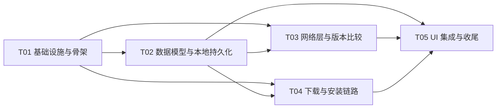

# GitHub 更新检测器 — 有序任务分解（v1.0）

> 角色：架构师 · 高见远（Gao）｜输入：`docs/01-PRD.md` + `docs/02-architecture.md`
> 工程师：寇豆码｜语言：简体中文
>
> 执行顺序满足「脚手架 → 数据层 → 网络层+版本比较 → 下载/安装 → UI 集成+收尾」流水线。
> 共 **5 个任务（T01–T05）**，按功能内聚分组（非单文件拆分）；组内子步骤请按编号顺序完成，保证每一步都可编译或可单测。
> 每个任务完成标准均可验证（assembleDebug 或 `./gradlew test` 或人工冒烟）。

---

## 依赖图

---

## T01 项目基础设施与可编译骨架

- **依赖**：无
- **优先级**：P0
- **目标**：建立可在 Android Studio 直接 Sync/构建的工程骨架；空壳 App 能跑通 MD3 主题 + 空列表占位 + 两个路由占位。
- **产出文件（22 个）**

| # | 文件 | 内容 |
|---|---|---|
| 1 | `settings.gradle.kts` | 仓库配置 + `include(":app")` |
| 2 | `build.gradle.kts`（根） | 4 插件 alias `apply false` |
| 3 | `gradle.properties` | useAndroidX、JVM args 等 |
| 4 | `gradle/libs.versions.toml` | 第 7 节全部版本目录 |
| 5 | `gradle/wrapper/gradle-wrapper.properties` | gradle-8.9（wrapper jar 由 AS 生成） |
| 6 | `app/build.gradle.kts` | compileSdk 35 / minSdk 26 / targetSdk 35 / Java 17 / compose=true / 依赖块 |
| 7 | `app/proguard-rules.pro` | 默认空 |
| 8 | `.gitignore` | 忽略 build/.gradle/local.properties |
| 9 | `app/src/main/AndroidManifest.xml` | 权限 + Application/MainActivity + FileProvider 声明 |
| 10 | `app/src/main/res/values/strings.xml` | 全部中文文案占位（应用名、界面标题、按钮、错误） |
| 11 | `app/src/main/res/values/themes.xml` | `Theme.AppUpdater`（NoActionBar） |
| 12 | `app/src/main/res/values/colors.xml` | `ic_launcher_background` |
| 13 | `app/src/main/res/drawable/ic_launcher_foreground.xml` | 极简矢量 |
| 14 | `app/src/main/res/mipmap-anydpi-v26/ic_launcher.xml` | 自适应图标 |
| 15 | `app/src/main/res/xml/file_paths.xml` | external-files-path downloads |
| 16 | `GitHubUpdaterApp.kt` | Application + `container` |
| 17 | `MainActivity.kt` | setContent Theme + NavHost |
| 18 | `ui/theme/Color.kt` | 种子色 + baseline 配色 |
| 19 | `ui/theme/Theme.kt` | GitHubUpdaterTheme（动态取色 + 深色） |
| 20 | `ui/theme/Type.kt` | M3 Typography |
| 21 | `ui/navigation/AppNavHost.kt` | 两路由占位（TrackingList 空占位 / Add 空占位） |
| 22 | `README.md`（可留空占位，T05 补全） | 项目说明 |

- **关键验收**
  - `./gradlew assembleDebug` 首次构建成功（AS 中执行）。
  - 安装启动显示 MD3 空列表占位页（暂无追踪 + FAB），深浅色/动态取色切换正常。
  - Manifest 含 `INTERNET / QUERY_ALL_PACKAGES / REQUEST_INSTALL_PACKAGES` 与 FileProvider。

---

## T02 数据模型与本地持久化

- **依赖**：T01
- **优先级**：P0
- **目标**：落地领域模型、Repository 接口、已装应用读取与 DataStore JSON 追踪持久化；为上层提供稳定的数据契约。
- **产出文件（11 个）**

| # | 文件 | 内容 |
|---|---|---|
| 1 | `domain/model/TrackedApp.kt` | @Serializable（字段见架构 4.1） |
| 2 | `domain/model/TrackedAppList.kt` | DataStore JSON 包装 |
| 3 | `domain/model/InstalledApp.kt` | 已装应用模型 |
| 4 | `domain/model/UpdateStatus.kt` | 5 态枚举 |
| 5 | `domain/repo/AppRepository.kt` | 接口：getInstalledApps |
| 6 | `domain/repo/TrackingRepository.kt` | 接口：tracks Flow + add/remove/update |
| 7 | `domain/repo/ReleaseRepository.kt` | 接口：fetchLatest（本任务仅声明） |
| 8 | `domain/repo/DownloadRepository.kt` | 接口 + DownloadState sealed（本任务仅声明） |
| 9 | `domain/repo/InstallRepository.kt` | 接口（本任务仅声明） |
| 10 | `data/repository/TrackingRepositoryImpl.kt` | DataStore `tracked_apps` key + kotlinx JSON 读写 + packageName 唯一性 |
| 11 | `data/repository/AppRepositoryImpl.kt` | PackageManager.getInstalledPackages(0) → launcher 应用 → 按 label 排序 → 过滤自身 |

- **附加**：`util/GitHubRepoParser.kt` 与单测可在本任务实现（供 T05 添加页用）。
- **关键验收**
  - `./gradlew test` 通过 GitHubRepoParserTest（若已写）。
  - `TrackingRepositoryImpl.add/remove/update` 语义正确；重复 packageName add 返回 failure。
  - `AppRepositoryImpl.getInstalledApps()` 返回非空、含 versionName/versionCode、不含本应用。

---

## T03 网络层与版本比较

- **依赖**：T01、T02
- **优先级**：P0
- **目标**：接入 GitHub Releases API，实现「拉最新 release → 选 .apk asset → 语义化版本比对 → 判定是否有新版」。
- **产出文件（7 个）**

| # | 文件 | 内容 |
|---|---|---|
| 1 | `domain/model/GitHubRelease.kt` | @Serializable DTO（tag_name/name/body/published_at/assets） |
| 2 | `domain/model/ReleaseAsset.kt` | @Serializable asset DTO |
| 3 | `domain/model/ReleaseInfo.kt` | 检测结果领域对象 |
| 4 | `data/api/GitHubApi.kt` | Retrofit：`suspend fun latestRelease(owner, repo): GitHubRelease` |
| 5 | `data/api/ApiFactory.kt` | OkHttp（连接/读超时、logging）+ Json(ignoreUnknownKeys) + Retrofit 单例 |
| 6 | `data/repository/ReleaseRepositoryImpl.kt` | fetchLatest：请求→首个 .apk asset→ReleaseInfo；异常→中文 message（网络/404/403/无 apk） |
| 7 | `data/VersionComparator.kt` | compareVersions / isUpdateAvailable / cleanVersion 纯函数 |

- **关键验收**
  - `VersionComparatorTest` 通过：`v1.2.3==1.2.3`、`1.2.3 < 2.0.0`、`1.2.3.1 > 1.2.3`、`1.2.3-beta` 处理稳定、`null/空`安全。
  - 代码编译通过；网络行为可在 T05 真机联调（无 release → 中文提示；403 → 限流提示）。

---

## T04 下载与安装链路

- **依赖**：T01、T02
- **优先级**：P0
- **目标**：DownloadManager 下载 + 进度/完成状态；FileProvider 拉起系统安装器 + 未知来源授权引导。
- **产出文件（2 个实现 + 复用 T01 的 xml/Manifest）**

| # | 文件 | 内容 |
|---|---|---|
| 1 | `data/repository/DownloadRepositoryImpl.kt` | enqueue（目标 `getExternalFilesDir(Download)`）；注册 `ACTION_DOWNLOAD_COMPLETE` 接收器（API33+ `RECEIVER_NOT_EXPORTED`）；`observe(id)` 轮询 query → Running/Completed/Failed |
| 2 | `data/repository/InstallRepositoryImpl.kt` | isInstallAllowed（ACTION_MANAGE_UNKNOWN_APP_SOURCES resolve）；openUnknownSourceSettings；openInstaller(file)：FileProvider.getUriForFile + ACTION_VIEW(apk mime) + FLAG_GRANT_READ_URI_PERMISSION + NEW_TASK |

- **附加**：确认 `AndroidManifest.xml`（T01）FileProvider authority 与 `xml/file_paths.xml` 的 `Download/` 路径与实际下载目录一致。
- **关键验收**
  - 代码编译通过。
  - 单测不可行处留 `// TODO 真机冒烟` 标注；真机冒烟步骤写 README（T05 完成）。
  - 未授权未知来源时 `isInstallAllowed()==false`；授权后可 `openInstaller` 拉起系统安装器。

---

## T05 UI 界面、集成与收尾

- **依赖**：T01、T02、T03、T04
- **优先级**：P0
- **目标**：实现全部界面与 ViewModel、组装 AppContainer、打通自动检测/下载/安装端到端，补全 README 并整体回归 A1–A6。
- **产出文件（新增 15 个 + 修改 3 个）**

| # | 文件 | 新增/修改 | 内容 |
|---|---|---|---|
| 1 | `di/AppContainer.kt` | 新增 | 懒加载 5 个 Repository 单例 + Json |
| 2 | `ui/trackinglist/TrackingListUiState.kt` | 新增 | UiState/ItemUiState/PendingUpdate/PendingInstall |
| 3 | `ui/trackinglist/TrackingListViewModel.kt` | 新增 | refreshAll（并行+单项失败隔离+首弹框）、下载/安装确认、跳过、删除 |
| 4 | `ui/trackinglist/TrackingListScreen.kt` | 新增 | Scaffold + TopAppBar(⟳) + FAB + 空态 + 列表 + Snackbar |
| 5 | `ui/trackinglist/TrackingListItem.kt` | 新增 | 卡片 + 状态徽标 + 点击/长按菜单删除 |
| 6 | `ui/trackinglist/UpdateAvailableDialog.kt` | 新增 | 发现新版本（当前/最新/说明/暂不/下载更新/跳过此版本） |
| 7 | `ui/trackinglist/InstallConfirmDialog.kt` | 新增 | 下载完成（稍后/安装 + 来源提示） |
| 8 | `ui/addtracking/AddTrackingUiState.kt` | 新增 | 应用列表/搜索/选择/仓库输入校验 |
| 9 | `ui/addtracking/AddTrackingViewModel.kt` | 新增 | 加载已装应用/过滤/校验/保存 |
| 10 | `ui/addtracking/AddTrackingScreen.kt` | 新增 | 单选列表(搜索) + 仓库 TextField + 保存 |
| 11 | `ui/components/AppIcon.kt` | 新增 | 图标加载 |
| 12 | `GitHubUpdaterApp.kt` | 修改 | 确保 container 注入 |
| 13 | `ui/navigation/AppNavHost.kt` | 修改 | 占位换真界面，route 常量 |
| 14 | `MainActivity.kt` | 修改 | 最终装配 |
| 15 | `app/src/main/res/values/strings.xml` | 修改 | 核对全部文案（含未知来源引导/来源提示） |
| 16 | `README.md` | 修改 | 构建/安装/使用/限流说明 |

- **关键验收（对应 A1–A6）**
  - A1：添加页列出已装应用（图标/名称/包名/版本）。
  - A2：选择应用 + 填写仓库 → 保存；重启应用绑定仍在；长按删除生效。
  - A3：打开即自动检测；最新/有新版本/检测失败三种状态正确；断网/错误仓库显示中文错误且不崩溃、不影响其他项。
  - A4：有新版本弹「发现新版本」（当前/最新版本）；仅点「下载更新」才下载；下载可见进度。
  - A5：下载完成弹「下载完成」；仅点「安装」拉起系统安装器；「稍后」无动作。
  - A6：四个界面/对话框均 MD3（动态取色、圆角卡片、Filled/tonal 按钮），深浅色跟随系统。
  - 真机全链路冒烟：安装 → 绑定（可先用本仓库的示例或自建 repo 测试）→ 重启自动检测 → 下载 → 安装。

---

## 共享知识与注意事项（工程师必读）

- 版本号只认 `gradle/libs.versions.toml`；新增依赖必须同步该文件。
- 所有 UI 文案在 `strings.xml`；颜色走 `MaterialTheme.colorScheme`。
- Retrofit/DataStore 均 suspend + `Dispatchers.IO`；UiState 用 StateFlow。
- Compose M3 实验 API 需 `@OptIn(ExperimentalMaterial3Api::class)`。
- FileProvider authority：`${applicationId}.fileprovider`；manifest 的 `android:authorities` 建议写成字面量 `com.example.githubupdater.fileprovider`（若改包名需同步）。
- 网络错误文案统一在 Repository 层转中文（网络异常 / 仓库不存在或无 Release / GitHub 接口限流）。
- 安装 Intent 必须带 `FLAG_GRANT_READ_URI_PERMISSION`；先查未知来源授权再拉起安装器。
- 测试命令：`./gradlew test`；构建：`./gradlew assembleDebug`。
- 最终交付：`assembleDebug` 通过 + `test` 通过 + 真机 6 项冒烟（A1–A6）记录在交付说明。
